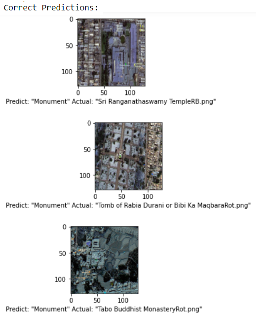
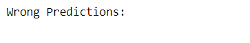

## **MO**nument **D**etection from sat**E**llite i**M**age (MODEM)

Try it out : http://monument-detection-from-satellite-image.eastus.cloudapp.azure.com

 
<!-- 
<b><i>How to use</i></b>
 -->

 

## __MOTIVATION__
---
In the old days, finding monuments was considered a monumental task for archaeologists. The story of the accidental discovery of the famous Khajuraho temple inspired me to look for evidence of monuments scattered around the world through satellite images. Given the recent advancement of CNNs and the easy availability of satellite images, I could concoct a solution to discover monuments from satellite images automatically.

## __PROBLEM STATEMENT__
---
The goal is to label a given satellite image as a monument with sufficient evidence backing the claim. The solution involves using CNNs and transfer-learning to learn the abstract monument representations and then using CAM (Class Activation Map) techniques to provide empirical justification for the classification.

## __SOLUTION DETAILS__
---
The solution has two modules:
1. **Data Collection Module:** I started with a small sample of hand-collected coordinates comprising 39 monuments and 25 random landmarks in India. Then I created a tool to collect satellite images using "[Bhuvanlite](https://bhuvanlite.nrsc.gov.in/)". However, this task was challenging without well-defined REST APIs, which I overcame by using the Mozilla plugin's automated screenshots of browser images. The images were trimmed, rotated, and shifted to create more samples. Thus I was able to generate 384 satellite images. 

2. **Model Selection and Tuning Parameters:** I used two different approaches to create models:  
+ Bare-bones CNN: Used a few Conv layers with max-pooling and some dense layers with relu activation in the penultimate layer and finally a dense sigmoid layer to achieve 0.9826 and 0.9487 as training and test accuracy, respectively.
+ Transfer learning: Used "[MobileNetV2](https://tfhub.dev/google/tf2-preview/mobilenet_v2/feature_vector/4)" and a few dense layers with relu activation to achieve 1.0 training and testing accuracy.

## __RESULTS__
---
+ ### _*ONLY CNN*_  
    #### Accuracy = 0.9487
     

    |  |
    |:---:|
    | <b>Some Correct Predictions</b>|
    |  |
    | <b>Wrong Predictions</b>|

 

+ ### _*TRANSFER LEARNING*_  
    #### Accuracy = 1.0
     

    |  |
    |:---:|
    | <b>Some Correct Predictions</b>|
    |  |
    | <b>Wrong Predictions</b>|

 

## __END TO END APPLICATION DEVELOPMENT DETAILS__
---
1. __Backend:__ As mentioned earlier, I had the transfer-learning-based model ready to predict the output for the user-given image at the frontend.

2. __API:__ The backend requires an API for receiving the input image from the user and returning the predicted result. I preferred _FastApi_ as it is fast and requires minimal effort in comparison to _Django_ or _Flask_.

3. __Frontend:__ The frontend consists of a sample satellite image gallery and a drop zone to try them out. One can also upload custom images in the drop zone. I preferred to make frontend _react-based_, as it is one of the latest libraries for frontend development.

4. __Docker:__ Once the whole project was up, the best way to make it work on any system was to dockerize it. The frontend and backend have been dockerized separately, and then both run in a single docker container.

5. __Hosting:__ As I had dockerized my project, I simply needed a virtual machine with docker to run my project. I decided to host it on azure and used “_haproxy_” for load balancing.

## __CONCLUSION__
---
Through my experiments, I can safely conclude that detecting monuments from satellite images can be achieved even with smaller samples with the help of transfer learning. Even though the satellite images of monuments are not present in a well-organized manner in any data repository, however, thanks to some government initiatives like "[Bhuvanlite](https://bhuvanlite.nrsc.gov.in/)", we can leverage their infrastructure to collect data. After these experiments, I feel that the next logical step is to decode the underlying patterns in monuments using explainable AI (like Class Activation Map techniques) to help archeologists search in the right direction.

Monument detection has many positive societal impacts. It can bolster local tourism opportunities and help local people identify their rich cultural heritage.

## __PRE REQUISITE__
---
#### __Tech Stack —__
+ Python __3.10.10__
+ Node __18.4.0__
+ Npm __9.4.1__ or Yarn __1.22.19__
+ React
+ Docker __20.10.22__
+ Docker-compose __2.15.1__

#### __For data_collection.py__ — You will need to install some python libraries and [geckodriver](https://github.com/mozilla/geckodriver/releases).
Run the following on windows powershell
+ `pip install selenium`
+ `pip install Pillow`
#### __For api__ — Open windows powershell in api folder and run the following command 
+ `pip install -r requirements.txt`
#### __For frontend__ — Open windows powershell in frontend folder and run the following command
+ `npm i` or `yarn install`

## __HOW TO USE__
---
1. Make changes to image locations if needed and run `python data_collection.py` to store the images for training the model.
2. Choose either `Monument_CNN_TransferLearn.ipynb` or `Monument_CNN.ipynb` and run.

## __LICENSE__
---
+ This repository has no open-source license.
+ You can't modify or redistribute the code without explicit permission. However, you are allowed to run the code for private/educational use only.
+ According to terms and conditions of GitHub, in absence of any open source license, every user has the right to view and fork any public repository only.
